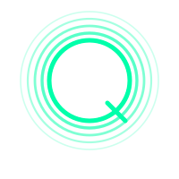

[← Volver al índice](../index.md)

<div align="center">
  
</div>

## Capítulo 24: La Misión Genesis - Acelerando el Descubrimiento Científico mediante IA y Computación Cuántica

Este capítulo analiza el impacto y las posibilidades de la **Misión Genesis**, anunciada por la Casa Blanca el 24 de noviembre de 2025, y explora cómo las tecnologías DI SOCIETA pueden complementar e integrarse con esta iniciativa histórica para transformar la investigación científica.

### 24.1 Contexto de la Misión Genesis

El 24 de noviembre de 2025, el Presidente de Estados Unidos firmó una Orden Ejecutiva lanzando la **Misión Genesis**, descrita como el mayor despliegue de recursos científicos federales desde el Programa Apollo y comparable en urgencia y ambición al Proyecto Manhattan.

**Definición Oficial:**

> "La Misión Genesis es un esfuerzo nacional dedicado y coordinado para desatar una nueva era de innovación y descubrimiento acelerado por IA que pueda resolver los problemas más desafiantes de este siglo."

**Liderazgo:**
- **Secretario de Energía:** Chris Wright
- **Director de la Misión:** Darío Gil, Subsecretario de Ciencia del DOE
- **Asesor Científico Presidencial:** Michael Krastios

```
┌─────────────────────────────────────────────────────────────┐
│              MISIÓN GENESIS - ARQUITECTURA                   │
├─────────────────────────────────────────────────────────────┤
│                                                             │
│  ┌─────────────────────────────────────────────────┐       │
│  │        PLATAFORMA NACIONAL DE DESCUBRIMIENTO     │       │
│  │                                                  │       │
│  │  ┌───────────┐  ┌───────────┐  ┌───────────┐   │       │
│  │  │   SUPER   │  │    IA     │  │  QUANTUM  │   │       │
│  │  │ COMPUTERS │◄─┼──►SYSTEMS │◄─┼──►SYSTEMS │   │       │
│  │  │           │  │           │  │           │   │       │
│  │  └─────┬─────┘  └─────┬─────┘  └─────┬─────┘   │       │
│  │        │              │              │         │       │
│  │        └──────────────┼──────────────┘         │       │
│  │                       ▼                         │       │
│  │         ┌─────────────────────────┐            │       │
│  │         │  INSTRUMENTOS CIENTÍFICOS│            │       │
│  │         │  AVANZADOS DE LA NACIÓN  │            │       │
│  │         └─────────────────────────┘            │       │
│  └─────────────────────────────────────────────────┘       │
│                                                             │
│  RECURSOS:                                                  │
│  • 17 Laboratorios Nacionales del DOE                      │
│  • ~40,000 científicos, ingenieros y técnicos              │
│  • Supercomputadores de clase mundial                      │
│  • Sistemas cuánticos de próxima generación                │
│  • Colaboración industria privada y academia               │
│                                                             │
└─────────────────────────────────────────────────────────────┘
```

### 24.2 Objetivos Estratégicos

La Misión Genesis tiene como objetivo central **duplicar la productividad e impacto de la investigación y desarrollo estadounidense** en una década, mediante la combinación de científicos humanos con sistemas inteligentes capaces de razonar, simular y experimentar a velocidades extraordinarias.

**Áreas de Enfoque Prioritarias:**

| Área | Descripción | Impacto Esperado |
|------|-------------|------------------|
| **Biotecnología** | Desarrollo de fármacos, genómica, medicina personalizada | Acelerar descubrimiento de tratamientos |
| **Materiales Críticos** | Nuevos materiales para baterías, semiconductores | Reducir dependencia de cadenas extranjeras |
| **Energía Nuclear (Fisión)** | Reactores avanzados, gestión de residuos | Dominancia energética limpia |
| **Fusión Nuclear** | Aceleración hacia energía de fusión comercial | Fuente energética ilimitada |
| **Exploración Espacial** | Propulsión avanzada, hábitats, recursos in-situ | Liderazgo en economía espacial |
| **Ciencia Cuántica** | Computación cuántica, sensores, comunicaciones | Supremacía tecnológica |
| **Semiconductores** | Diseño y fabricación avanzada | Independencia en microelectrónica |

### 24.3 Infraestructura Tecnológica

**Sistema Solstice:**

Uno de los componentes centrales de la Misión Genesis es **Solstice**, un sistema de IA de escala sin precedentes:

```
┌─────────────────────────────────────────────────────────────┐
│                    SISTEMA SOLSTICE                          │
├─────────────────────────────────────────────────────────────┤
│                                                             │
│  UBICACIÓN: Argonne National Laboratory                     │
│                                                             │
│  ┌─────────────────────────────────────────────────┐       │
│  │                                                  │       │
│  │         100,000 GPUs NVIDIA                     │       │
│  │                                                  │       │
│  │    ┌────┐ ┌────┐ ┌────┐ ┌────┐ ┌────┐         │       │
│  │    │GPU │ │GPU │ │GPU │ │GPU │ │... │         │       │
│  │    │    │ │    │ │    │ │    │ │    │         │       │
│  │    └────┘ └────┘ └────┘ └────┘ └────┘         │       │
│  │              × 100,000 unidades                │       │
│  │                                                  │       │
│  └─────────────────────────────────────────────────┘       │
│                                                             │
│  SOCIOS:                                                    │
│  • DOE (Departamento de Energía)                           │
│  • NVIDIA                                                   │
│  • Oracle Cloud Infrastructure                              │
│  • Argonne National Laboratory                              │
│                                                             │
│  CAPACIDADES:                                               │
│  • Entrenamiento de modelos fundacionales científicos      │
│  • Simulaciones a escala sin precedentes                   │
│  • Procesamiento de datos de instrumentos científicos      │
│                                                             │
└─────────────────────────────────────────────────────────────┘
```

**Colaboradores del Sector Privado:**

La Misión Genesis integra las principales empresas de IA y computación del mundo:

| Empresa | Contribución Principal |
|---------|----------------------|
| **Anthropic** | Modelos de IA seguros y alineados |
| **OpenAI** | Modelos de lenguaje para investigación |
| **NVIDIA** | GPUs y software de computación IA |
| **IBM** | Sistemas cuánticos y software |
| **Microsoft** | Azure, herramientas de investigación |
| **AMD** | Procesadores de alto rendimiento |
| **AWS** | Infraestructura cloud |
| **Google** | IA y computación cuántica |
| **Oracle** | Cloud infrastructure (Solstice) |

### 24.4 La Dimensión Cuántica

La Misión Genesis integra explícitamente la computación cuántica como componente estratégico, creando una plataforma híbrida que combina:

```
┌─────────────────────────────────────────────────────────────┐
│     INTEGRACIÓN CUÁNTICO-CLÁSICA EN GENESIS                 │
├─────────────────────────────────────────────────────────────┤
│                                                             │
│  NIVEL 1: SUPERCOMPUTACIÓN CLÁSICA                         │
│  ┌─────────────────────────────────────────────────┐       │
│  │ Frontier (Oak Ridge) • Aurora (Argonne)         │       │
│  │ El Capitan (LLNL) • Summit (Oak Ridge)          │       │
│  │ Capacidad: ExaFLOPS (10^18 operaciones/seg)     │       │
│  └──────────────────────┬──────────────────────────┘       │
│                         │                                   │
│                         ▼                                   │
│  NIVEL 2: ACELERACIÓN IA                                   │
│  ┌─────────────────────────────────────────────────┐       │
│  │ Solstice (100K GPUs) • Modelos Fundacionales    │       │
│  │ Razonamiento científico • Predicción            │       │
│  └──────────────────────┬──────────────────────────┘       │
│                         │                                   │
│                         ▼                                   │
│  NIVEL 3: COMPUTACIÓN CUÁNTICA                             │
│  ┌─────────────────────────────────────────────────┐       │
│  │ IBM Quantum • Google Sycamore • IonQ            │       │
│  │ Optimización • Simulación molecular             │       │
│  │ Problemas intratables clásicamente              │       │
│  └─────────────────────────────────────────────────┘       │
│                                                             │
│  APLICACIONES HÍBRIDAS:                                     │
│  • Diseño de materiales cuánticos                          │
│  • Simulación de sistemas químicos complejos               │
│  • Optimización de redes energéticas                       │
│  • Modelado climático de alta precisión                    │
│  • Descubrimiento de fármacos                              │
│                                                             │
└─────────────────────────────────────────────────────────────┘
```

**Aplicaciones Cuánticas Prioritarias:**

1. **Fusión Nuclear (PPPL):** Desarrollo de gemelos digitales de experimentos de fusión usando modelos fundacionales híbridos cuántico-clásicos

2. **Física de Partículas (Fermilab):** IA y machine learning para resolver misterios de materia, energía, espacio y tiempo

3. **Seguridad Nacional (NNSA):** IA, computación cuántica y analítica avanzada para fortalecer disuasión estratégica

### 24.5 Impacto en la Ciencia Global

La Misión Genesis representa un cambio de paradigma en cómo se conduce la investigación científica:

**Antes de Genesis:**
```
┌─────────────────────────────────────────────────────────────┐
│              MODELO TRADICIONAL DE INVESTIGACIÓN             │
├─────────────────────────────────────────────────────────────┤
│                                                             │
│  Hipótesis → Diseño → Experimento → Datos → Análisis       │
│      │          │          │          │         │          │
│      └──────────┴──────────┴──────────┴─────────┘          │
│                     MESES A AÑOS                            │
│                                                             │
│  • Silos institucionales                                   │
│  • Datos fragmentados                                      │
│  • Capacidad computacional limitada                        │
│  • Iteraciones lentas                                      │
│                                                             │
└─────────────────────────────────────────────────────────────┘
```

**Con Genesis:**
```
┌─────────────────────────────────────────────────────────────┐
│              MODELO GENESIS DE DESCUBRIMIENTO                │
├─────────────────────────────────────────────────────────────┤
│                                                             │
│  ┌─────────────────────────────────────────────────┐       │
│  │               CICLO ACELERADO                    │       │
│  │                                                  │       │
│  │     ┌──────┐    ┌──────┐    ┌──────┐           │       │
│  │     │  IA  │───►│SIMUL.│───►│ EXP. │           │       │
│  │     │GENERA│    │RÁPIDA│    │ROBOT.│           │       │
│  │     └───▲──┘    └──────┘    └───┬──┘           │       │
│  │         │                       │               │       │
│  │         └───────────────────────┘               │       │
│  │              HORAS A DÍAS                        │       │
│  │                                                  │       │
│  └─────────────────────────────────────────────────┘       │
│                                                             │
│  • Plataforma unificada                                    │
│  • Datos federados accesibles                              │
│  • ExaFLOPS de capacidad                                   │
│  • Laboratorios robóticos autónomos                        │
│  • Modelos fundacionales científicos                       │
│                                                             │
└─────────────────────────────────────────────────────────────┘
```

### 24.6 Oportunidades para Tecnologías DI SOCIETA

La Misión Genesis, aunque centralizada en el DOE y laboratorios nacionales, presenta múltiples oportunidades para integración con sistemas descentralizados:

#### 24.6.1 Verificación de Resultados Científicos

**Problema:** La ciencia enfrenta una crisis de reproducibilidad. Estudios muestran que un alto porcentaje de resultados publicados no pueden ser replicados.

**Solución: "ScienceChain"**

```
┌─────────────────────────────────────────────────────────────┐
│     SCIENCECHAIN - VERIFICACIÓN DESCENTRALIZADA             │
├─────────────────────────────────────────────────────────────┤
│                                                             │
│  ┌─────────────────────────────────────────────────┐       │
│  │         PROCESO DE INVESTIGACIÓN                 │       │
│  │                                                  │       │
│  │  Diseño    →   Datos   →  Análisis  → Resultado │       │
│  │    │            │           │            │       │       │
│  │    ▼            ▼           ▼            ▼       │       │
│  │  ┌────┐      ┌────┐      ┌────┐      ┌────┐    │       │
│  │  │HASH│      │HASH│      │HASH│      │HASH│    │       │
│  │  └──┬─┘      └──┬─┘      └──┬─┘      └──┬─┘    │       │
│  │     │           │           │           │       │       │
│  │     └───────────┴───────────┴───────────┘       │       │
│  │                      │                          │       │
│  │                      ▼                          │       │
│  │            ┌──────────────────┐                 │       │
│  │            │   BLOCKCHAIN     │                 │       │
│  │            │   CIENTÍFICA     │                 │       │
│  │            └──────────────────┘                 │       │
│  └─────────────────────────────────────────────────┘       │
│                                                             │
│  BENEFICIOS:                                                │
│  • Timestamp inmutable de descubrimientos                  │
│  • Trazabilidad completa del proceso                       │
│  • Verificación por terceros                               │
│  • Prioridad de invención demostrable                      │
│  • Reproducibilidad auditada                               │
│                                                             │
└─────────────────────────────────────────────────────────────┘
```

**Smart Contract de Registro Científico:**

```solidity
contract RegistroCientificoGenesis {
    struct Experimento {
        bytes32 id;
        address investigador;
        address laboratorio;
        bytes32 hashProtocolo;
        bytes32 hashDatos;
        bytes32 hashResultados;
        uint256 timestampInicio;
        uint256 timestampFin;
        EstadoVerificacion estado;
        address[] verificadores;
    }

    enum EstadoVerificacion {
        Registrado,
        EnVerificacion,
        Verificado,
        NoReproducible,
        Disputado
    }

    mapping(bytes32 => Experimento) public experimentos;
    mapping(bytes32 => mapping(address => bool)) public verificaciones;

    event ExperimentoRegistrado(
        bytes32 indexed id,
        address investigador,
        string laboratorio
    );
    event ResultadoVerificado(
        bytes32 indexed id,
        address verificador,
        bool reproducido
    );

    function registrarExperimento(
        bytes32 hashProtocolo,
        bytes32 hashDatos,
        string calldata metadataIPFS
    ) external returns (bytes32) {
        bytes32 id = keccak256(abi.encodePacked(
            msg.sender,
            hashProtocolo,
            block.timestamp
        ));

        experimentos[id] = Experimento({
            id: id,
            investigador: msg.sender,
            laboratorio: _getLaboratorio(msg.sender),
            hashProtocolo: hashProtocolo,
            hashDatos: hashDatos,
            hashResultados: bytes32(0),
            timestampInicio: block.timestamp,
            timestampFin: 0,
            estado: EstadoVerificacion.Registrado,
            verificadores: new address[](0)
        });

        emit ExperimentoRegistrado(id, msg.sender, "Genesis Lab");
        return id;
    }

    function verificarReproducibilidad(
        bytes32 experimentoId,
        bytes32 hashResultadosReplicados,
        bool reproducido
    ) external onlyVerificadorAutorizado {
        Experimento storage exp = experimentos[experimentoId];
        require(!verificaciones[experimentoId][msg.sender]);

        verificaciones[experimentoId][msg.sender] = true;
        exp.verificadores.push(msg.sender);

        if (exp.verificadores.length >= 3) {
            exp.estado = reproducido ?
                EstadoVerificacion.Verificado :
                EstadoVerificacion.NoReproducible;
        }

        emit ResultadoVerificado(experimentoId, msg.sender, reproducido);
    }
}
```

#### 24.6.2 DAO de Investigación Colaborativa

**Problema:** Los laboratorios nacionales, universidades y empresas privadas en Genesis necesitan coordinar investigación sin centralizar el control.

**Solución: "GenesisDAO"**

```
┌─────────────────────────────────────────────────────────────┐
│              GENESIS DAO - GOBERNANZA CIENTÍFICA             │
├─────────────────────────────────────────────────────────────┤
│                                                             │
│  PARTICIPANTES:                                             │
│  ┌─────────────────────────────────────────────────┐       │
│  │                                                  │       │
│  │  17 Labs   + Universidades + Empresas + Público │       │
│  │    DOE     │   MIT, Stanford│ NVIDIA, IBM│ Ciud.│       │
│  │            │   Berkeley...  │ Anthropic  │      │       │
│  │                                                  │       │
│  └─────────────────────────────────────────────────┘       │
│                         │                                   │
│                         ▼                                   │
│  MECANISMOS DE GOBERNANZA:                                 │
│  ┌─────────────────────────────────────────────────┐       │
│  │                                                  │       │
│  │  • Votación ponderada por contribución          │       │
│  │  • Propuestas de proyectos de investigación     │       │
│  │  • Asignación descentralizada de recursos       │       │
│  │  • Revisión por pares tokenizada                │       │
│  │  • Incentivos por resultados verificables       │       │
│  │                                                  │       │
│  └─────────────────────────────────────────────────┘       │
│                         │                                   │
│                         ▼                                   │
│  TOKENS:                                                    │
│  ┌─────────────────────────────────────────────────┐       │
│  │                                                  │       │
│  │  $GENESIS   →  Gobernanza y votación            │       │
│  │  $DISCOVERY →  Recompensas por descubrimientos  │       │
│  │  $COMPUTE   →  Acceso a recursos computacionales│       │
│  │                                                  │       │
│  └─────────────────────────────────────────────────┘       │
│                                                             │
└─────────────────────────────────────────────────────────────┘
```

#### 24.6.3 Mercado de Datos Científicos

**Problema:** Genesis generará cantidades masivas de datos. El acceso y la monetización de estos datos debe ser transparente y equitativo.

**Solución: "SciDataMarket"**

```
┌─────────────────────────────────────────────────────────────┐
│          SCIDATAMARKET - MERCADO DE DATOS CIENTÍFICOS        │
├─────────────────────────────────────────────────────────────┤
│                                                             │
│  PROVEEDORES                    CONSUMIDORES                │
│  ┌───────────────┐              ┌───────────────┐          │
│  │ Labs DOE      │              │ Universidades │          │
│  │ Instrumentos  │              │ Startups      │          │
│  │ Simulaciones  │◄────────────►│ Pharma        │          │
│  │ Experimentos  │   $SCIDATA   │ Industria     │          │
│  └───────────────┘              └───────────────┘          │
│          │                             │                    │
│          └─────────────┬───────────────┘                    │
│                        ▼                                    │
│  ┌─────────────────────────────────────────────────┐       │
│  │              SMART CONTRACT                      │       │
│  │                                                  │       │
│  │  • Licenciamiento automático                    │       │
│  │  • Pagos por uso (micropagos)                   │       │
│  │  • Atribución verificable                       │       │
│  │  • Acceso condicional (propósito, duración)     │       │
│  │  • Royalties por derivados                      │       │
│  │                                                  │       │
│  └─────────────────────────────────────────────────┘       │
│                                                             │
│  CATEGORÍAS DE DATOS:                                       │
│  ├─ Genómicos (biotecnología)                              │
│  ├─ Materiales (estructuras, propiedades)                  │
│  ├─ Simulaciones de fusión                                 │
│  ├─ Datos cuánticos (calibración, resultados)              │
│  └─ Modelos entrenados (fundacionales científicos)         │
│                                                             │
└─────────────────────────────────────────────────────────────┘
```

#### 24.6.4 Trazabilidad de Propiedad Intelectual

**Problema:** Los descubrimientos de Genesis involucran múltiples instituciones. La atribución de PI es compleja.

**Solución: "GenesisIP"**

```solidity
contract GenesisIPRegistry {
    struct Invento {
        bytes32 id;
        string titulo;
        string descripcionIPFS;
        address[] inventores;
        uint256[] contribuciones;    // Porcentajes
        address[] instituciones;
        uint256 fechaRegistro;
        EstadoPatente estado;
        bytes32[] dependencias;      // Inventos previos utilizados
    }

    struct Licencia {
        bytes32 inventoId;
        address licenciatario;
        TipoLicencia tipo;
        uint256 royaltyBPS;          // Basis points
        uint256 fechaInicio;
        uint256 fechaFin;
        string restricciones;
    }

    enum EstadoPatente { Provisional, EnTramite, Otorgada, Expirada }
    enum TipoLicencia { Exclusiva, NoExclusiva, Investigacion, Comercial }

    mapping(bytes32 => Invento) public inventos;
    mapping(bytes32 => Licencia[]) public licencias;

    event InventoRegistrado(bytes32 indexed id, string titulo, address[] inventores);
    event LicenciaOtorgada(bytes32 indexed inventoId, address licenciatario);
    event RoyaltyDistribuido(bytes32 indexed inventoId, uint256 monto);

    function registrarInvento(
        string calldata titulo,
        string calldata descripcionIPFS,
        address[] calldata inventores,
        uint256[] calldata contribuciones,
        bytes32[] calldata dependencias
    ) external onlyInstitucionGenesis returns (bytes32) {
        require(inventores.length == contribuciones.length);
        require(_sumaContribuciones(contribuciones) == 10000); // 100%

        bytes32 id = keccak256(abi.encodePacked(
            titulo, block.timestamp, inventores
        ));

        inventos[id] = Invento({
            id: id,
            titulo: titulo,
            descripcionIPFS: descripcionIPFS,
            inventores: inventores,
            contribuciones: contribuciones,
            instituciones: _getInstituciones(inventores),
            fechaRegistro: block.timestamp,
            estado: EstadoPatente.Provisional,
            dependencias: dependencias
        });

        emit InventoRegistrado(id, titulo, inventores);
        return id;
    }

    function distribuirRoyalties(bytes32 inventoId) external payable {
        Invento storage inv = inventos[inventoId];
        uint256 monto = msg.value;

        for (uint i = 0; i < inv.inventores.length; i++) {
            uint256 pago = (monto * inv.contribuciones[i]) / 10000;
            payable(inv.inventores[i]).transfer(pago);
        }

        emit RoyaltyDistribuido(inventoId, monto);
    }
}
```

### 24.7 Implicaciones para Argentina y el Ecosistema DI SOCIETA

La Misión Genesis tiene implicaciones directas para Argentina y las iniciativas presentadas en capítulos anteriores:

#### 24.7.1 Conexión con el Acuerdo Comercial US-AR (Capítulo 23)

```
┌─────────────────────────────────────────────────────────────┐
│     GENESIS + ACUERDO US-AR: SINERGIAS                       │
├─────────────────────────────────────────────────────────────┤
│                                                             │
│  MINERALES CRÍTICOS (Litio Argentino)                      │
│  ┌─────────────────────────────────────────────────┐       │
│  │                                                  │       │
│  │  Genesis necesita:                              │       │
│  │  • Litio para baterías de sistemas de cómputo  │       │
│  │  • Materiales para semiconductores             │       │
│  │  • Tierras raras para componentes cuánticos    │       │
│  │                                                  │       │
│  │  Argentina ofrece:                              │       │
│  │  • Segundo mayor recurso de litio mundial      │       │
│  │  • Acuerdo comercial preferencial con EE.UU.   │       │
│  │  • CriticalMinerals US-AR para trazabilidad    │       │
│  │                                                  │       │
│  └─────────────────────────────────────────────────┘       │
│                                                             │
│  COOPERACIÓN CIENTÍFICA                                    │
│  ┌─────────────────────────────────────────────────┐       │
│  │                                                  │       │
│  │  Oportunidades:                                 │       │
│  │  • Acceso a recursos computacionales Genesis   │       │
│  │  • Participación en investigación de fusión    │       │
│  │  • Colaboración en ciencia cuántica            │       │
│  │  • Transferencia tecnológica                   │       │
│  │                                                  │       │
│  │  Mecanismo: DataBridge US-AR + GenesisDAO      │       │
│  │                                                  │       │
│  └─────────────────────────────────────────────────┘       │
│                                                             │
└─────────────────────────────────────────────────────────────┘
```

#### 24.7.2 Oportunidades para Instituciones Argentinas

| Institución | Área de Colaboración | Contribución Potencial |
|-------------|---------------------|----------------------|
| **CONICET** | Investigación básica | Expertise en física, química, biología |
| **CNEA** | Energía nuclear | Experiencia en reactores de investigación |
| **INVAP** | Tecnología espacial | Satélites, instrumentación |
| **INTI** | Materiales | Caracterización, estándares |
| **CONAE** | Observación terrestre | Datos satelitales para modelos |
| **Universidades** | Talento científico | Investigadores, estudiantes |

#### 24.7.3 Propuesta: "Genesis Gateway Argentina"

```
┌─────────────────────────────────────────────────────────────┐
│          GENESIS GATEWAY ARGENTINA                           │
├─────────────────────────────────────────────────────────────┤
│                                                             │
│  OBJETIVO: Conectar la ciencia argentina con Genesis       │
│                                                             │
│  ┌─────────────────────────────────────────────────┐       │
│  │                                                  │       │
│  │     ARGENTINA              GENESIS PLATFORM     │       │
│  │                                                  │       │
│  │   ┌─────────┐                ┌─────────┐       │       │
│  │   │ CONICET │                │   DOE   │       │       │
│  │   │  CNEA   │◄──────────────►│  Labs   │       │       │
│  │   │ INVAP   │   Gateway      │         │       │       │
│  │   │  Unis   │                │         │       │       │
│  │   └─────────┘                └─────────┘       │       │
│  │        │                          │            │       │
│  │        ▼                          ▼            │       │
│  │   ┌─────────────────────────────────────┐     │       │
│  │   │        SERVICIOS DEL GATEWAY         │     │       │
│  │   │                                      │     │       │
│  │   │  • Acceso a supercomputadores        │     │       │
│  │   │  • Colaboración en proyectos         │     │       │
│  │   │  • Intercambio de investigadores     │     │       │
│  │   │  • Licenciamiento de tecnología      │     │       │
│  │   │  • Datos compartidos (SciDataMarket) │     │       │
│  │   │                                      │     │       │
│  │   └─────────────────────────────────────┘     │       │
│  │                                                  │       │
│  └─────────────────────────────────────────────────┘       │
│                                                             │
│  GOBERNANZA: DAO bilateral con participación de:           │
│  • Ministerio de Ciencia Argentina                         │
│  • DOE (Estados Unidos)                                    │
│  • Instituciones participantes                             │
│  • Comunidad científica (votación por contribución)        │
│                                                             │
└─────────────────────────────────────────────────────────────┘
```

### 24.8 Seguridad Post-Cuántica en Genesis

Dado que Genesis integra sistemas cuánticos, la seguridad post-cuántica es crítica:

```
┌─────────────────────────────────────────────────────────────┐
│     SEGURIDAD POST-CUÁNTICA PARA GENESIS DI SOCIETA         │
├─────────────────────────────────────────────────────────────┤
│                                                             │
│  PARADOJA DE GENESIS:                                       │
│  La misma computación cuántica que Genesis desarrolla      │
│  amenaza la seguridad de los sistemas blockchain           │
│  tradicionales que podrían integrarse.                     │
│                                                             │
│  SOLUCIÓN: CRIPTOGRAFÍA HÍBRIDA                            │
│  ┌─────────────────────────────────────────────────┐       │
│  │                                                  │       │
│  │  CAPA 1: Algoritmos Clásicos (compatibilidad)   │       │
│  │  ├─ ECDSA para firmas                           │       │
│  │  └─ AES-256 para cifrado                        │       │
│  │                                                  │       │
│  │  CAPA 2: Algoritmos Post-Cuánticos (futuro)     │       │
│  │  ├─ Dilithium/Falcon para firmas                │       │
│  │  ├─ Kyber para intercambio de claves            │       │
│  │  └─ SPHINCS+ como respaldo                      │       │
│  │                                                  │       │
│  │  Validación: Ambas capas deben verificar        │       │
│  │                                                  │       │
│  └─────────────────────────────────────────────────┘       │
│                                                             │
│  IMPLEMENTACIÓN PARA GENESIS:                              │
│  • ScienceChain: Firmas híbridas desde día 1              │
│  • GenesisDAO: Votación con pruebas post-cuánticas        │
│  • SciDataMarket: Cifrado híbrido para datos sensibles    │
│  • GenesisIP: Timestamps con hash post-cuántico           │
│                                                             │
└─────────────────────────────────────────────────────────────┘
```

### 24.9 Cronograma de Integración

| Fase | Período | Actividades | Hitos |
|------|---------|-------------|-------|
| **1** | 2026 H1 | Diseño de protocolos DI SOCIETA para Genesis | Especificaciones técnicas |
| **1** | 2026 H1 | Negociación Genesis Gateway Argentina | MoU bilateral |
| **2** | 2026 H2 | Piloto ScienceChain con 2-3 labs | 1,000 experimentos registrados |
| **2** | 2026 H2 | Lanzamiento GenesisDAO (beta) | 100 instituciones participantes |
| **3** | 2027 | SciDataMarket operacional | 10,000 datasets disponibles |
| **3** | 2027 | Integración Argentina-Genesis | 5 proyectos colaborativos |
| **4** | 2028 | Migración a seguridad post-cuántica | Sistemas híbridos activos |
| **4** | 2028 | GenesisIP con USPTO/INPI integrados | Registro PI automatizado |

### 24.10 Análisis de Impacto

#### 24.10.1 Impacto Científico

La Misión Genesis, combinada con tecnologías DI SOCIETA, puede:

1. **Acelerar descubrimientos** mediante verificación distribuida y reproducibilidad mejorada

2. **Democratizar acceso** a recursos computacionales de clase mundial

3. **Transparentar la ciencia** con registros inmutables de procesos y resultados

4. **Incentivar colaboración** mediante tokens y gobernanza descentralizada

5. **Proteger propiedad intelectual** con registros blockchain de prioridad

#### 24.10.2 Impacto Geopolítico

```
┌─────────────────────────────────────────────────────────────┐
│     GENESIS EN EL CONTEXTO GEOPOLÍTICO GLOBAL               │
├─────────────────────────────────────────────────────────────┤
│                                                             │
│  COMPETENCIA TECNOLÓGICA                                    │
│                                                             │
│  ┌─────────────┐   ┌─────────────┐   ┌─────────────┐      │
│  │  ESTADOS    │   │    CHINA    │   │   EUROPA    │      │
│  │  UNIDOS     │   │             │   │             │      │
│  │             │   │             │   │             │      │
│  │  Genesis    │   │  Programas  │   │  Horizon    │      │
│  │  Mission    │   │  nacionales │   │  Europe     │      │
│  │             │   │  de IA/QC   │   │             │      │
│  └─────────────┘   └─────────────┘   └─────────────┘      │
│                                                             │
│  IMPLICACIONES PARA PAÍSES ALIADOS (Argentina):            │
│                                                             │
│  ✓ Acceso preferencial a tecnología Genesis               │
│  ✓ Participación en cadenas de suministro críticas        │
│  ✓ Colaboración científica privilegiada                   │
│  ✓ Transferencia tecnológica                              │
│  ✓ Formación de talento en labs de EE.UU.                 │
│                                                             │
│  RIESGO: Dependencia tecnológica vs. soberanía            │
│  MITIGACIÓN: Desarrollo de capacidades propias +          │
│              participación equitativa via DAO              │
│                                                             │
└─────────────────────────────────────────────────────────────┘
```

#### 24.10.3 Impacto Económico

| Área | Impacto Estimado |
|------|------------------|
| **I+D global** | $50-100B en nueva inversión anual |
| **Empleos científicos** | +500,000 empleos técnicos en EE.UU. |
| **Startups deeptech** | Aceleración de spin-offs de laboratorios |
| **Patentes** | Duplicación de patentes en áreas prioritarias |
| **Comercialización** | Reducción 50% en tiempo idea→mercado |
| **Argentina específico** | Oportunidad de $1-5B en exportaciones de minerales y servicios científicos |

### 24.11 Riesgos y Mitigaciones

| Riesgo | Probabilidad | Impacto | Mitigación |
|--------|--------------|---------|-----------|
| Centralización excesiva en DOE | Media | Alto | Gobernanza DAO, transparencia blockchain |
| Exclusión de países aliados | Baja | Alto | Genesis Gateway, acuerdos bilaterales |
| Amenaza cuántica a sistemas existentes | Alta | Crítico | Criptografía post-cuántica proactiva |
| Concentración de PI en pocos actores | Media | Medio | GenesisIP con distribución equitativa |
| Acceso inequitativo a datos | Media | Medio | SciDataMarket con precios diferenciados |
| Dependencia de proveedores privados | Alta | Medio | Multi-cloud, estándares abiertos |

### 24.12 Conclusión

La Misión Genesis representa un momento pivotal en la historia de la ciencia y la tecnología. Al combinar los supercomputadores más poderosos del mundo, sistemas de inteligencia artificial de frontera, y computación cuántica emergente, Estados Unidos busca transformar fundamentalmente cómo se conduce la investigación científica.

Para el ecosistema DI SOCIETA, Genesis presenta una oportunidad única:

1. **Complementariedad:** La descentralización puede resolver problemas que la centralización de Genesis no aborda: verificación, transparencia, gobernanza equitativa

2. **Escala:** Integrar blockchain con la infraestructura de Genesis significa operar a una escala sin precedentes

3. **Legitimidad:** La asociación con laboratorios nacionales de prestigio mundial otorga credibilidad a sistemas descentralizados

4. **Innovación:** Los datos y descubrimientos de Genesis, gestionados mediante DI SOCIETA, pueden democratizar el acceso a la ciencia de frontera

Para Argentina específicamente, Genesis representa:

- **Oportunidad estratégica** de fortalecer lazos científicos con EE.UU.
- **Acceso a recursos** computacionales de clase mundial
- **Mercado para minerales críticos** con demanda garantizada
- **Desarrollo de talento** mediante colaboración internacional
- **Soberanía tecnológica** mediante participación equitativa vía DAOs

La integración inteligente de tecnologías DI SOCIETA con la Misión Genesis puede crear un nuevo paradigma de ciencia abierta, verificable y democrática que beneficie no solo a Estados Unidos sino a toda la humanidad.

---

**Fuentes:**

- [Launching the Genesis Mission – The White House](https://www.whitehouse.gov/presidential-actions/2025/11/launching-the-genesis-mission/)
- [Fact Sheet: President Donald J. Trump Unveils the Genesis Mission - The White House](https://www.whitehouse.gov/fact-sheets/2025/11/fact-sheet-president-donald-j-trump-unveils-the-genesis-missionto-accelerate-ai-for-scientific-discovery/)
- [Energy Department Launches 'Genesis Mission' - Department of Energy](https://www.energy.gov/articles/energy-department-launches-genesis-mission-transform-american-science-and-innovation)
- [Trump signs executive order launching Genesis Mission AI project - NBC News](https://www.nbcnews.com/tech/tech-news/trump-signs-executive-order-launching-genesis-mission-ai-project-rcna245600)
- [Trump signs executive order launching "Genesis" mission - CBS News](https://www.cbsnews.com/news/trump-executive-order-genesis-mission-ai-scientific-discovery-super-computer/)
- [White House Launches Genesis Mission to Link Supercomputers And Quantum Systems - The Quantum Insider](https://thequantuminsider.com/2025/11/25/white-house-launches-genesis-mission-to-link-supercomputers-and-quantum-systems/)
- [White House launches Genesis Mission to spur AI with federal assets - Nextgov/FCW](https://www.nextgov.com/artificial-intelligence/2025/11/white-house-launches-genesis-mission-spur-ai-federal-assets/409777/)
